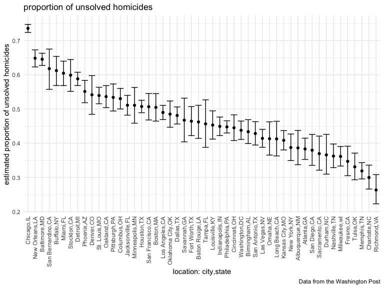
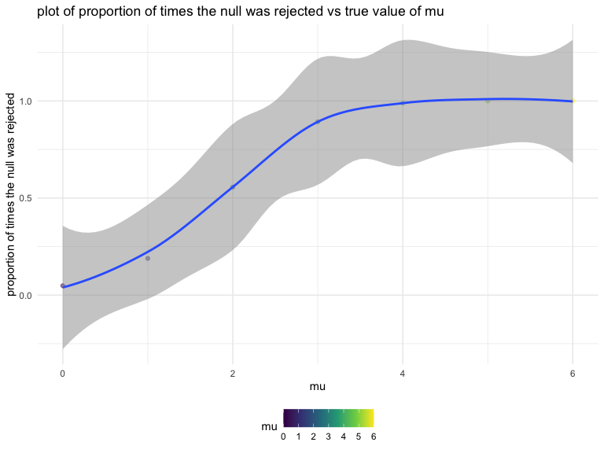
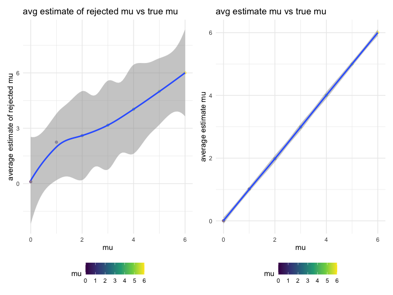

p8105_hw5_jd3924
================
Jiahe Deng
2022-11-07

``` r
library(tidyverse)
```

    ## ── Attaching packages ─────────────────────────────────────── tidyverse 1.3.2 ──
    ## ✔ ggplot2 3.3.6      ✔ purrr   0.3.5 
    ## ✔ tibble  3.1.8      ✔ dplyr   1.0.10
    ## ✔ tidyr   1.2.1      ✔ stringr 1.4.1 
    ## ✔ readr   2.1.3      ✔ forcats 0.5.2 
    ## ── Conflicts ────────────────────────────────────────── tidyverse_conflicts() ──
    ## ✖ dplyr::filter() masks stats::filter()
    ## ✖ dplyr::lag()    masks stats::lag()

``` r
library(p8105.datasets)
library(viridis)
```

    ## 载入需要的程辑包：viridisLite

``` r
knitr::opts_chunk$set(
    echo = TRUE,
    warning = FALSE,
    fig.width = 8, 
  fig.height = 6,
  out.width = "90%"
)

options(
  ggplot2.continuous.colour = "viridis",
  ggplot2.continuous.fill = "viridis"
)

scale_colour_discrete = scale_colour_viridis_d
scale_fill_discrete = scale_fill_viridis_d

theme_set(theme_minimal() + theme(legend.position = "bottom"))
```

## Problem 1

The code chunk below imports the data in individual spreadsheets
contained in `./data/zip_data/`. To do this, I create a dataframe that
includes the list of all files in that directory and the complete path
to each file. As a next step, I `map` over paths and import data using
the `read_csv` function. Finally, I `unnest` the result of `map`.

``` r
full_df = 
  tibble(
    files = list.files("data/zip_data/"),
    path = str_c("data/zip_data/", files)
  ) %>% 
  mutate(data = map(path, read_csv)) %>% 
  unnest()
```

    ## Rows: 1 Columns: 8
    ## ── Column specification ────────────────────────────────────────────────────────
    ## Delimiter: ","
    ## dbl (8): week_1, week_2, week_3, week_4, week_5, week_6, week_7, week_8
    ## 
    ## ℹ Use `spec()` to retrieve the full column specification for this data.
    ## ℹ Specify the column types or set `show_col_types = FALSE` to quiet this message.
    ## Rows: 1 Columns: 8
    ## ── Column specification ────────────────────────────────────────────────────────
    ## Delimiter: ","
    ## dbl (8): week_1, week_2, week_3, week_4, week_5, week_6, week_7, week_8
    ## 
    ## ℹ Use `spec()` to retrieve the full column specification for this data.
    ## ℹ Specify the column types or set `show_col_types = FALSE` to quiet this message.
    ## Rows: 1 Columns: 8
    ## ── Column specification ────────────────────────────────────────────────────────
    ## Delimiter: ","
    ## dbl (8): week_1, week_2, week_3, week_4, week_5, week_6, week_7, week_8
    ## 
    ## ℹ Use `spec()` to retrieve the full column specification for this data.
    ## ℹ Specify the column types or set `show_col_types = FALSE` to quiet this message.
    ## Rows: 1 Columns: 8
    ## ── Column specification ────────────────────────────────────────────────────────
    ## Delimiter: ","
    ## dbl (8): week_1, week_2, week_3, week_4, week_5, week_6, week_7, week_8
    ## 
    ## ℹ Use `spec()` to retrieve the full column specification for this data.
    ## ℹ Specify the column types or set `show_col_types = FALSE` to quiet this message.
    ## Rows: 1 Columns: 8
    ## ── Column specification ────────────────────────────────────────────────────────
    ## Delimiter: ","
    ## dbl (8): week_1, week_2, week_3, week_4, week_5, week_6, week_7, week_8
    ## 
    ## ℹ Use `spec()` to retrieve the full column specification for this data.
    ## ℹ Specify the column types or set `show_col_types = FALSE` to quiet this message.
    ## Rows: 1 Columns: 8
    ## ── Column specification ────────────────────────────────────────────────────────
    ## Delimiter: ","
    ## dbl (8): week_1, week_2, week_3, week_4, week_5, week_6, week_7, week_8
    ## 
    ## ℹ Use `spec()` to retrieve the full column specification for this data.
    ## ℹ Specify the column types or set `show_col_types = FALSE` to quiet this message.
    ## Rows: 1 Columns: 8
    ## ── Column specification ────────────────────────────────────────────────────────
    ## Delimiter: ","
    ## dbl (8): week_1, week_2, week_3, week_4, week_5, week_6, week_7, week_8
    ## 
    ## ℹ Use `spec()` to retrieve the full column specification for this data.
    ## ℹ Specify the column types or set `show_col_types = FALSE` to quiet this message.
    ## Rows: 1 Columns: 8
    ## ── Column specification ────────────────────────────────────────────────────────
    ## Delimiter: ","
    ## dbl (8): week_1, week_2, week_3, week_4, week_5, week_6, week_7, week_8
    ## 
    ## ℹ Use `spec()` to retrieve the full column specification for this data.
    ## ℹ Specify the column types or set `show_col_types = FALSE` to quiet this message.
    ## Rows: 1 Columns: 8
    ## ── Column specification ────────────────────────────────────────────────────────
    ## Delimiter: ","
    ## dbl (8): week_1, week_2, week_3, week_4, week_5, week_6, week_7, week_8
    ## 
    ## ℹ Use `spec()` to retrieve the full column specification for this data.
    ## ℹ Specify the column types or set `show_col_types = FALSE` to quiet this message.
    ## Rows: 1 Columns: 8
    ## ── Column specification ────────────────────────────────────────────────────────
    ## Delimiter: ","
    ## dbl (8): week_1, week_2, week_3, week_4, week_5, week_6, week_7, week_8
    ## 
    ## ℹ Use `spec()` to retrieve the full column specification for this data.
    ## ℹ Specify the column types or set `show_col_types = FALSE` to quiet this message.
    ## Rows: 1 Columns: 8
    ## ── Column specification ────────────────────────────────────────────────────────
    ## Delimiter: ","
    ## dbl (8): week_1, week_2, week_3, week_4, week_5, week_6, week_7, week_8
    ## 
    ## ℹ Use `spec()` to retrieve the full column specification for this data.
    ## ℹ Specify the column types or set `show_col_types = FALSE` to quiet this message.
    ## Rows: 1 Columns: 8
    ## ── Column specification ────────────────────────────────────────────────────────
    ## Delimiter: ","
    ## dbl (8): week_1, week_2, week_3, week_4, week_5, week_6, week_7, week_8
    ## 
    ## ℹ Use `spec()` to retrieve the full column specification for this data.
    ## ℹ Specify the column types or set `show_col_types = FALSE` to quiet this message.
    ## Rows: 1 Columns: 8
    ## ── Column specification ────────────────────────────────────────────────────────
    ## Delimiter: ","
    ## dbl (8): week_1, week_2, week_3, week_4, week_5, week_6, week_7, week_8
    ## 
    ## ℹ Use `spec()` to retrieve the full column specification for this data.
    ## ℹ Specify the column types or set `show_col_types = FALSE` to quiet this message.
    ## Rows: 1 Columns: 8
    ## ── Column specification ────────────────────────────────────────────────────────
    ## Delimiter: ","
    ## dbl (8): week_1, week_2, week_3, week_4, week_5, week_6, week_7, week_8
    ## 
    ## ℹ Use `spec()` to retrieve the full column specification for this data.
    ## ℹ Specify the column types or set `show_col_types = FALSE` to quiet this message.
    ## Rows: 1 Columns: 8
    ## ── Column specification ────────────────────────────────────────────────────────
    ## Delimiter: ","
    ## dbl (8): week_1, week_2, week_3, week_4, week_5, week_6, week_7, week_8
    ## 
    ## ℹ Use `spec()` to retrieve the full column specification for this data.
    ## ℹ Specify the column types or set `show_col_types = FALSE` to quiet this message.
    ## Rows: 1 Columns: 8
    ## ── Column specification ────────────────────────────────────────────────────────
    ## Delimiter: ","
    ## dbl (8): week_1, week_2, week_3, week_4, week_5, week_6, week_7, week_8
    ## 
    ## ℹ Use `spec()` to retrieve the full column specification for this data.
    ## ℹ Specify the column types or set `show_col_types = FALSE` to quiet this message.
    ## Rows: 1 Columns: 8
    ## ── Column specification ────────────────────────────────────────────────────────
    ## Delimiter: ","
    ## dbl (8): week_1, week_2, week_3, week_4, week_5, week_6, week_7, week_8
    ## 
    ## ℹ Use `spec()` to retrieve the full column specification for this data.
    ## ℹ Specify the column types or set `show_col_types = FALSE` to quiet this message.
    ## Rows: 1 Columns: 8
    ## ── Column specification ────────────────────────────────────────────────────────
    ## Delimiter: ","
    ## dbl (8): week_1, week_2, week_3, week_4, week_5, week_6, week_7, week_8
    ## 
    ## ℹ Use `spec()` to retrieve the full column specification for this data.
    ## ℹ Specify the column types or set `show_col_types = FALSE` to quiet this message.
    ## Rows: 1 Columns: 8
    ## ── Column specification ────────────────────────────────────────────────────────
    ## Delimiter: ","
    ## dbl (8): week_1, week_2, week_3, week_4, week_5, week_6, week_7, week_8
    ## 
    ## ℹ Use `spec()` to retrieve the full column specification for this data.
    ## ℹ Specify the column types or set `show_col_types = FALSE` to quiet this message.
    ## Rows: 1 Columns: 8
    ## ── Column specification ────────────────────────────────────────────────────────
    ## Delimiter: ","
    ## dbl (8): week_1, week_2, week_3, week_4, week_5, week_6, week_7, week_8
    ## 
    ## ℹ Use `spec()` to retrieve the full column specification for this data.
    ## ℹ Specify the column types or set `show_col_types = FALSE` to quiet this message.

The result of the previous code chunk isn’t tidy – data are wide rather
than long, and some important variables are included as parts of others.
The code chunk below tides the data using string manipulations on the
file, converting from wide to long, and selecting relevant variables.

``` r
tidy_df = 
  full_df %>% 
  mutate(
    files = str_replace(files, ".csv", ""),
    group = str_sub(files, 1, 3)) %>% 
  pivot_longer(
    week_1:week_8,
    names_to = "week",
    values_to = "outcome",
    names_prefix = "week_") %>% 
  mutate(week = as.numeric(week)) %>% 
  select(group, subj = files, week, outcome)
```

Finally, the code chunk below creates a plot showing individual data,
faceted by group.

``` r
tidy_df %>% 
  ggplot(aes(x = week, y = outcome, group = subj, color = group)) + 
  geom_point() + 
  geom_path() + 
  facet_grid(~group)
```


This plot suggests high within-subject correlation – subjects who start
above average end up above average, and those that start below average
end up below average. Subjects in the control group generally don’t
change over time, but those in the experiment group increase their
outcome in a roughly linear way.

## Problem 2

``` r
urlfile = "https://raw.githubusercontent.com/washingtonpost/data-homicides/master/homicide-data.csv"
homicides_data = read_csv(url(urlfile), na = c(" ", "Unknown"))
```

    ## Rows: 52179 Columns: 12
    ## ── Column specification ────────────────────────────────────────────────────────
    ## Delimiter: ","
    ## chr (8): uid, victim_last, victim_first, victim_race, victim_sex, city, stat...
    ## dbl (4): reported_date, victim_age, lat, lon
    ## 
    ## ℹ Use `spec()` to retrieve the full column specification for this data.
    ## ℹ Specify the column types or set `show_col_types = FALSE` to quiet this message.

In this data, there is 52179 observations and 12 variables. This data
include each case’s detailed information, such as victim’s
name(victim_first,victim_race), age(victim_age),gender(victim_sex),
race(victim_race),location(city, state, lat, lon), the progress of the
case(disposition), case’s reported data(reported_date).

``` r
homicides_data = 
  homicides_data %>%
  mutate(
    city_state = str_c(city,state, sep = ","),
    case_status = ifelse(disposition %in% c("Closed without arrest","Open/No arrest"), "unsolved","solved")
         ) %>% relocate(city_state) %>% 
  filter(city_state != "Tulsa,AL")
homicides_data
```

    ## # A tibble: 52,178 × 14
    ##    city_state  uid   repor…¹ victi…² victi…³ victi…⁴ victi…⁵ victi…⁶ city  state
    ##    <chr>       <chr>   <dbl> <chr>   <chr>   <chr>     <dbl> <chr>   <chr> <chr>
    ##  1 Albuquerqu… Alb-…  2.01e7 GARCIA  JUAN    Hispan…      78 Male    Albu… NM   
    ##  2 Albuquerqu… Alb-…  2.01e7 MONTOYA CAMERON Hispan…      17 Male    Albu… NM   
    ##  3 Albuquerqu… Alb-…  2.01e7 SATTER… VIVIANA White        15 Female  Albu… NM   
    ##  4 Albuquerqu… Alb-…  2.01e7 MENDIO… CARLOS  Hispan…      32 Male    Albu… NM   
    ##  5 Albuquerqu… Alb-…  2.01e7 MULA    VIVIAN  White        72 Female  Albu… NM   
    ##  6 Albuquerqu… Alb-…  2.01e7 BOOK    GERALD… White        91 Female  Albu… NM   
    ##  7 Albuquerqu… Alb-…  2.01e7 MALDON… DAVID   Hispan…      52 Male    Albu… NM   
    ##  8 Albuquerqu… Alb-…  2.01e7 MALDON… CONNIE  Hispan…      52 Female  Albu… NM   
    ##  9 Albuquerqu… Alb-…  2.01e7 MARTIN… GUSTAVO White        56 Male    Albu… NM   
    ## 10 Albuquerqu… Alb-…  2.01e7 HERRERA ISRAEL  Hispan…      43 Male    Albu… NM   
    ## # … with 52,168 more rows, 4 more variables: lat <dbl>, lon <dbl>,
    ## #   disposition <chr>, case_status <chr>, and abbreviated variable names
    ## #   ¹​reported_date, ²​victim_last, ³​victim_first, ⁴​victim_race, ⁵​victim_age,
    ## #   ⁶​victim_sex

``` r
homicides_data %>%
  group_by(city_state) %>%
  summarize(
    number_of_unsolved = sum(case_status=="unsolved"),
    number_of_homicides = n())
```

    ## # A tibble: 50 × 3
    ##    city_state     number_of_unsolved number_of_homicides
    ##    <chr>                       <int>               <int>
    ##  1 Albuquerque,NM                146                 378
    ##  2 Atlanta,GA                    373                 973
    ##  3 Baltimore,MD                 1825                2827
    ##  4 Baton Rouge,LA                196                 424
    ##  5 Birmingham,AL                 347                 800
    ##  6 Boston,MA                     310                 614
    ##  7 Buffalo,NY                    319                 521
    ##  8 Charlotte,NC                  206                 687
    ##  9 Chicago,IL                   4073                5535
    ## 10 Cincinnati,OH                 309                 694
    ## # … with 40 more rows

``` r
baltimore_data = 
  homicides_data %>%
  filter(city_state == "Baltimore,MD")

baltimore_summary = 
  baltimore_data %>%
  summarise(
    unsolved_md = sum(case_status == "unsolved"),
    num = n())

prop.test(
  x = baltimore_summary %>% pull(unsolved_md),
  n = baltimore_summary %>% pull(num)
  ) %>%
  broom::tidy()
```

    ## # A tibble: 1 × 8
    ##   estimate statistic  p.value parameter conf.low conf.high method        alter…¹
    ##      <dbl>     <dbl>    <dbl>     <int>    <dbl>     <dbl> <chr>         <chr>  
    ## 1    0.646      239. 6.46e-54         1    0.628     0.663 1-sample pro… two.si…
    ## # … with abbreviated variable name ¹​alternative

``` r
prop_test = function(city){
  
  city_summary = 
    city %>% 
      summarise(
        unsolved = sum(case_status == 'unsolved'),
        n = n()
      )
  
  city_test = 
    prop.test(
      x = city_summary %>% pull(unsolved),
      n = city_summary %>% pull(n)
    )
  
  city_test
}
```

``` r
#use Baltimore to test whether the function works
prop_test(baltimore_data)
```

    ## 
    ##  1-sample proportions test with continuity correction
    ## 
    ## data:  city_summary %>% pull(unsolved) out of city_summary %>% pull(n), null probability 0.5
    ## X-squared = 239.01, df = 1, p-value < 2.2e-16
    ## alternative hypothesis: true p is not equal to 0.5
    ## 95 percent confidence interval:
    ##  0.6275625 0.6631599
    ## sample estimates:
    ##         p 
    ## 0.6455607

``` r
statistic_df =
  homicides_data %>%
  nest(-city_state) %>%
  mutate(
    result = map(data, prop_test),
    tidy_data = map(result, broom::tidy)
  ) %>%
  select(city_state, tidy_data) %>%
  unnest(tidy_data) %>%
  select(city_state, estimate, starts_with("conf"))
statistic_df
```

    ## # A tibble: 50 × 4
    ##    city_state     estimate conf.low conf.high
    ##    <chr>             <dbl>    <dbl>     <dbl>
    ##  1 Albuquerque,NM    0.386    0.337     0.438
    ##  2 Atlanta,GA        0.383    0.353     0.415
    ##  3 Baltimore,MD      0.646    0.628     0.663
    ##  4 Baton Rouge,LA    0.462    0.414     0.511
    ##  5 Birmingham,AL     0.434    0.399     0.469
    ##  6 Boston,MA         0.505    0.465     0.545
    ##  7 Buffalo,NY        0.612    0.569     0.654
    ##  8 Charlotte,NC      0.300    0.266     0.336
    ##  9 Chicago,IL        0.736    0.724     0.747
    ## 10 Cincinnati,OH     0.445    0.408     0.483
    ## # … with 40 more rows

``` r
statistic_df %>%
  mutate(city_state = fct_reorder(city_state, estimate,.desc = TRUE)) %>%
  ggplot(aes(x = city_state, y = estimate)) +
  geom_point() +
  geom_errorbar(aes(ymin = conf.low, ymax = conf.high)) +
  theme(axis.text.x = element_text(angle = 90, vjust = 0.5, hjust = 1)) +
  labs(
    title = "proportion of unsolved homicides",
    x = "location: city,state",
    y = "estimated proportion of unsolved homicides",
    caption = "Data from the Washington Post")
```



## Problem 3

``` r
#Conduct a hypothesis T test for n = 30, sigma = 5
sim_mean_sd = function(n, mu, sigma) {
     sample_x = rnorm(n, mean = mu, sd = sigma)
     t_test = t.test(sample_x, conf.int = 0.95) %>%
       broom::tidy() %>%
       select(estimate, p.value)
     
     return(t_test)
}
output = vector("list", 5000)
for (i in 1:5000) {
  output[[i]] = sim_mean_sd(n = 30, mu = 0, sigma = 5)
}
output %>% bind_rows()
```

    ## # A tibble: 5,000 × 2
    ##    estimate p.value
    ##       <dbl>   <dbl>
    ##  1   0.0637  0.936 
    ##  2   1.19    0.136 
    ##  3   2.04    0.0591
    ##  4  -1.94    0.0692
    ##  5   1.56    0.139 
    ##  6  -0.184   0.830 
    ##  7   0.803   0.381 
    ##  8   1.89    0.0241
    ##  9   0.796   0.425 
    ## 10   0.388   0.723 
    ## # … with 4,990 more rows

``` r
#when mu={1,2,3,4,5,6}
results_df =
  tibble(mu = c(0, 1, 2, 3, 4, 5, 6)) %>%
  mutate(
    results = map(.x = mu, ~rerun(5000, sim_mean_sd(n=30,mu=.x,sigma=5))),
    estimated = map(results, bind_rows)) %>%
  unnest(estimated) %>%
  select(mu, estimate, p.value)
results_df
```

    ## # A tibble: 35,000 × 3
    ##       mu estimate p.value
    ##    <dbl>    <dbl>   <dbl>
    ##  1     0   -0.352   0.665
    ##  2     0    0.731   0.452
    ##  3     0    0.273   0.756
    ##  4     0    0.670   0.418
    ##  5     0   -1.13    0.182
    ##  6     0    0.899   0.301
    ##  7     0   -0.925   0.356
    ##  8     0    0.406   0.680
    ##  9     0   -0.761   0.465
    ## 10     0   -0.803   0.413
    ## # … with 34,990 more rows

``` r
power_test =
  results_df %>%
  mutate(
    reject = ifelse(p.value < 0.05, 1, 0)
      ) %>%
  group_by(mu) %>%
  summarize(
    n_reject = sum(reject),
    prop_reject = n_reject / n()
    ) %>%
  rbind()
power_test
```

    ## # A tibble: 7 × 3
    ##      mu n_reject prop_reject
    ##   <dbl>    <dbl>       <dbl>
    ## 1     0      241      0.0482
    ## 2     1      945      0.189 
    ## 3     2     2783      0.557 
    ## 4     3     4463      0.893 
    ## 5     4     4943      0.989 
    ## 6     5     4999      1.00  
    ## 7     6     5000      1

``` r
power_test_plot =
  power_test %>%
  ggplot(aes(x = mu, y = prop_reject)) +geom_point(aes(color = mu), alpha = 0.5) +
  geom_smooth(alpha = 0.5) +
  theme(legend.position = "bottom") +
  labs(
    title = "plot of proportion of times the null was rejected vs true value of mu",
    x = "mu",
    y = "proportion of times the null was rejected") 
power_test_plot
```

    ## `geom_smooth()` using method = 'loess' and formula 'y ~ x'


From the plot above, we can see that there is positive relationship
between the plot of proportion of times the null was rejected and the
true mean, which means the proportion increase as the true mean
increase, and the power of test increase too.

``` r
library(patchwork)
average_estimate =
  results_df %>%
  group_by(mu) %>%
  summarize(
    avg = mean(estimate)
  )
average_estimate
```

    ## # A tibble: 7 × 2
    ##      mu     avg
    ##   <dbl>   <dbl>
    ## 1     0 0.00495
    ## 2     1 1.02   
    ## 3     2 1.98   
    ## 4     3 2.99   
    ## 5     4 4.01   
    ## 6     5 5.00   
    ## 7     6 6.00

``` r
avg_estimate_plot =
  average_estimate %>%
  ggplot(aes(x = mu, y = avg)) +
  geom_point(aes(color = mu), alpha = 0.5) +
  geom_smooth(alpha = 0.5) +
  theme(legend.position = "bottom") +
  labs(
    title = "avg estimate mu vs true mu",
    x = "mu",
    y = "average estimate mu"
) 

rej_average_estimate =
  results_df %>%
  filter(p.value < 0.05) %>%
  group_by(mu) %>%
  summarize(
    avg = mean(estimate)
  )
rej_average_estimate
```

    ## # A tibble: 7 × 2
    ##      mu   avg
    ##   <dbl> <dbl>
    ## 1     0 0.104
    ## 2     1 2.25 
    ## 3     2 2.60 
    ## 4     3 3.17 
    ## 5     4 4.03 
    ## 6     5 5.00 
    ## 7     6 6.00

``` r
rej_avg_estimate_plot =
  rej_average_estimate %>%
  ggplot(aes(x = mu, y = avg)) +
  geom_point(aes(color = mu), alpha = 0.5) +
  geom_smooth(alpha = 0.5) +
  theme(legend.position = "bottom") +
  labs(
    title = "avg estimate of rejected mu vs true mu",
    x = "mu",
    y = "average estimate of rejected mu"
)
rej_avg_estimate_plot+avg_estimate_plot
```

    ## `geom_smooth()` using method = 'loess' and formula 'y ~ x'
    ## `geom_smooth()` using method = 'loess' and formula 'y ~ x'


From the plot on the left, we can see that the average estimated mu in
samples for which the null was rejected is slightly differ from the true
mean, which display as not a small curve at the begging. But for mu\>=2,
there is no much differents between them. From the plot on the right, we
can see that the average estimated mu is equal to the true mean. It is
because if the average estimated mu is is equal to the true mean, then
it could not be rejected, so there is a small curve on the beginning of
the plot on the left. Also because our sample size is big enough, the
test result is realiable.
