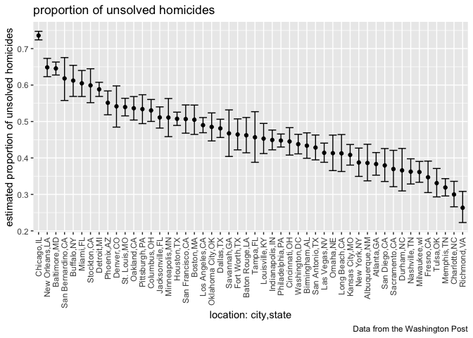

p8105_hw5_jd3924
================
Jiahe Deng
2022-11-07

``` r
library(tidyverse)
```

    ## ── Attaching packages ─────────────────────────────────────── tidyverse 1.3.2 ──
    ## ✔ ggplot2 3.3.6      ✔ purrr   0.3.5 
    ## ✔ tibble  3.1.8      ✔ dplyr   1.0.10
    ## ✔ tidyr   1.2.1      ✔ stringr 1.4.1 
    ## ✔ readr   2.1.3      ✔ forcats 0.5.2 
    ## ── Conflicts ────────────────────────────────────────── tidyverse_conflicts() ──
    ## ✖ dplyr::filter() masks stats::filter()
    ## ✖ dplyr::lag()    masks stats::lag()

``` r
urlfile = "https://raw.githubusercontent.com/washingtonpost/data-homicides/master/homicide-data.csv"
homicides_data = read_csv(url(urlfile), na = c(" ", "Unknown"))
```

    ## Warning: One or more parsing issues, call `problems()` on your data frame for details,
    ## e.g.:
    ##   dat <- vroom(...)
    ##   problems(dat)

    ## Rows: 52179 Columns: 12
    ## ── Column specification ────────────────────────────────────────────────────────
    ## Delimiter: ","
    ## chr (8): uid, victim_last, victim_first, victim_race, victim_sex, city, stat...
    ## dbl (4): reported_date, victim_age, lat, lon
    ## 
    ## ℹ Use `spec()` to retrieve the full column specification for this data.
    ## ℹ Specify the column types or set `show_col_types = FALSE` to quiet this message.

In this data, there is 52179 observations and 12 variables. This data
include each case’s detailed information, such as victim’s
name(victim_first,victim_race), age(victim_age),gender(victim_sex),
race(victim_race),location(city, state, lat, lon), the progress of the
case(disposition), case’s reported data(reported_date).

``` r
homicides_data = 
  homicides_data %>%
  mutate(
    city_state = str_c(city,state, sep = ","),
    case_status = ifelse(disposition %in% c("Closed without arrest","Open/No arrest"), "unsolved","solved")
         ) %>% relocate(city_state) %>% 
  filter(city_state != "Tulsa,AL")
homicides_data
```

    ## # A tibble: 52,178 × 14
    ##    city_state  uid   repor…¹ victi…² victi…³ victi…⁴ victi…⁵ victi…⁶ city  state
    ##    <chr>       <chr>   <dbl> <chr>   <chr>   <chr>     <dbl> <chr>   <chr> <chr>
    ##  1 Albuquerqu… Alb-…  2.01e7 GARCIA  JUAN    Hispan…      78 Male    Albu… NM   
    ##  2 Albuquerqu… Alb-…  2.01e7 MONTOYA CAMERON Hispan…      17 Male    Albu… NM   
    ##  3 Albuquerqu… Alb-…  2.01e7 SATTER… VIVIANA White        15 Female  Albu… NM   
    ##  4 Albuquerqu… Alb-…  2.01e7 MENDIO… CARLOS  Hispan…      32 Male    Albu… NM   
    ##  5 Albuquerqu… Alb-…  2.01e7 MULA    VIVIAN  White        72 Female  Albu… NM   
    ##  6 Albuquerqu… Alb-…  2.01e7 BOOK    GERALD… White        91 Female  Albu… NM   
    ##  7 Albuquerqu… Alb-…  2.01e7 MALDON… DAVID   Hispan…      52 Male    Albu… NM   
    ##  8 Albuquerqu… Alb-…  2.01e7 MALDON… CONNIE  Hispan…      52 Female  Albu… NM   
    ##  9 Albuquerqu… Alb-…  2.01e7 MARTIN… GUSTAVO White        56 Male    Albu… NM   
    ## 10 Albuquerqu… Alb-…  2.01e7 HERRERA ISRAEL  Hispan…      43 Male    Albu… NM   
    ## # … with 52,168 more rows, 4 more variables: lat <dbl>, lon <dbl>,
    ## #   disposition <chr>, case_status <chr>, and abbreviated variable names
    ## #   ¹​reported_date, ²​victim_last, ³​victim_first, ⁴​victim_race, ⁵​victim_age,
    ## #   ⁶​victim_sex

``` r
homicides_data %>%
  group_by(city_state) %>%
  summarize(
    number_of_unsolved = sum(case_status=="unsolved"),
    number_of_homicides = n())
```

    ## # A tibble: 50 × 3
    ##    city_state     number_of_unsolved number_of_homicides
    ##    <chr>                       <int>               <int>
    ##  1 Albuquerque,NM                146                 378
    ##  2 Atlanta,GA                    373                 973
    ##  3 Baltimore,MD                 1825                2827
    ##  4 Baton Rouge,LA                196                 424
    ##  5 Birmingham,AL                 347                 800
    ##  6 Boston,MA                     310                 614
    ##  7 Buffalo,NY                    319                 521
    ##  8 Charlotte,NC                  206                 687
    ##  9 Chicago,IL                   4073                5535
    ## 10 Cincinnati,OH                 309                 694
    ## # … with 40 more rows

``` r
baltimore_data = 
  homicides_data %>%
  filter(city_state == "Baltimore,MD")

baltimore_summary = 
  baltimore_data %>%
  summarise(
    unsolved_md = sum(case_status == "unsolved"),
    num = n())

prop.test(
  x = baltimore_summary %>% pull(unsolved_md),
  n = baltimore_summary %>% pull(num)
  ) %>%
  broom::tidy()
```

    ## # A tibble: 1 × 8
    ##   estimate statistic  p.value parameter conf.low conf.high method        alter…¹
    ##      <dbl>     <dbl>    <dbl>     <int>    <dbl>     <dbl> <chr>         <chr>  
    ## 1    0.646      239. 6.46e-54         1    0.628     0.663 1-sample pro… two.si…
    ## # … with abbreviated variable name ¹​alternative

``` r
prop_test = function(city){
  
  city_summary = 
    city %>% 
      summarise(
        unsolved = sum(case_status == 'unsolved'),
        n = n()
      )
  
  city_test = 
    prop.test(
      x = city_summary %>% pull(unsolved),
      n = city_summary %>% pull(n)
    )
  
  city_test
}
```

``` r
#use Baltimore to test whether the function works
prop_test(baltimore_data)
```

    ## 
    ##  1-sample proportions test with continuity correction
    ## 
    ## data:  city_summary %>% pull(unsolved) out of city_summary %>% pull(n), null probability 0.5
    ## X-squared = 239.01, df = 1, p-value < 2.2e-16
    ## alternative hypothesis: true p is not equal to 0.5
    ## 95 percent confidence interval:
    ##  0.6275625 0.6631599
    ## sample estimates:
    ##         p 
    ## 0.6455607

``` r
statistic_df =
  homicides_data %>%
  nest(-city_state) %>%
  mutate(
    result = map(data, prop_test),
    tidy_data = map(result, broom::tidy)
  ) %>%
  select(city_state, tidy_data) %>%
  unnest(tidy_data) %>%
  select(city_state, estimate, starts_with("conf"))
```

    ## Warning: All elements of `...` must be named.
    ## Did you want `data = -city_state`?

``` r
statistic_df
```

    ## # A tibble: 50 × 4
    ##    city_state     estimate conf.low conf.high
    ##    <chr>             <dbl>    <dbl>     <dbl>
    ##  1 Albuquerque,NM    0.386    0.337     0.438
    ##  2 Atlanta,GA        0.383    0.353     0.415
    ##  3 Baltimore,MD      0.646    0.628     0.663
    ##  4 Baton Rouge,LA    0.462    0.414     0.511
    ##  5 Birmingham,AL     0.434    0.399     0.469
    ##  6 Boston,MA         0.505    0.465     0.545
    ##  7 Buffalo,NY        0.612    0.569     0.654
    ##  8 Charlotte,NC      0.300    0.266     0.336
    ##  9 Chicago,IL        0.736    0.724     0.747
    ## 10 Cincinnati,OH     0.445    0.408     0.483
    ## # … with 40 more rows

``` r
statistic_df %>%
  mutate(city_state = fct_reorder(city_state, estimate,.desc = TRUE)) %>%
  ggplot(aes(x = city_state, y = estimate)) +
  geom_point() +
  geom_errorbar(aes(ymin = conf.low, ymax = conf.high)) +
  theme(axis.text.x = element_text(angle = 90, vjust = 0.5, hjust = 1)) +
  labs(
    title = "proportion of unsolved homicides",
    x = "location: city,state",
    y = "estimated proportion of unsolved homicides",
    caption = "Data from the Washington Post")
```

<!-- -->

``` r
#Conduct a hypothesis T test for n = 30, sigma = 5
sim_funct = function( 
    n = 30, 
    mu = 0,
    sigma = 5) {
  x = rnorm(n, mean = mu, sd = sigma)
  t_test = t.test(x, conf.int = 0.95) %>% broom::tidy()
  
  t_test
}
output = vector("list",5000) #Generate 5000 datasets for mu=0
for (i in 1: 5000) {
  output[[i]] = sim_funct()
}
output %>% bind_rows()
```

    ## # A tibble: 5,000 × 8
    ##    estimate statistic p.value parameter conf.low conf.high method        alter…¹
    ##       <dbl>     <dbl>   <dbl>     <dbl>    <dbl>     <dbl> <chr>         <chr>  
    ##  1   1.27       1.11   0.276         29  -1.07       3.60  One Sample t… two.si…
    ##  2  -0.585     -0.576  0.569         29  -2.66       1.49  One Sample t… two.si…
    ##  3  -0.933     -1.06   0.298         29  -2.73       0.867 One Sample t… two.si…
    ##  4  -0.452     -0.427  0.672         29  -2.62       1.71  One Sample t… two.si…
    ##  5   1.37       2.13   0.0415        29   0.0566     2.69  One Sample t… two.si…
    ##  6   0.0983     0.100  0.921         29  -1.91       2.10  One Sample t… two.si…
    ##  7   1.26       1.41   0.169         29  -0.566      3.09  One Sample t… two.si…
    ##  8  -2.21      -2.28   0.0304        29  -4.19      -0.223 One Sample t… two.si…
    ##  9  -0.349     -0.359  0.723         29  -2.34       1.64  One Sample t… two.si…
    ## 10   1.96       1.69   0.101         29  -0.406      4.33  One Sample t… two.si…
    ## # … with 4,990 more rows, and abbreviated variable name ¹​alternative

``` r
#mu={1,2,3,4,5,6}
```
